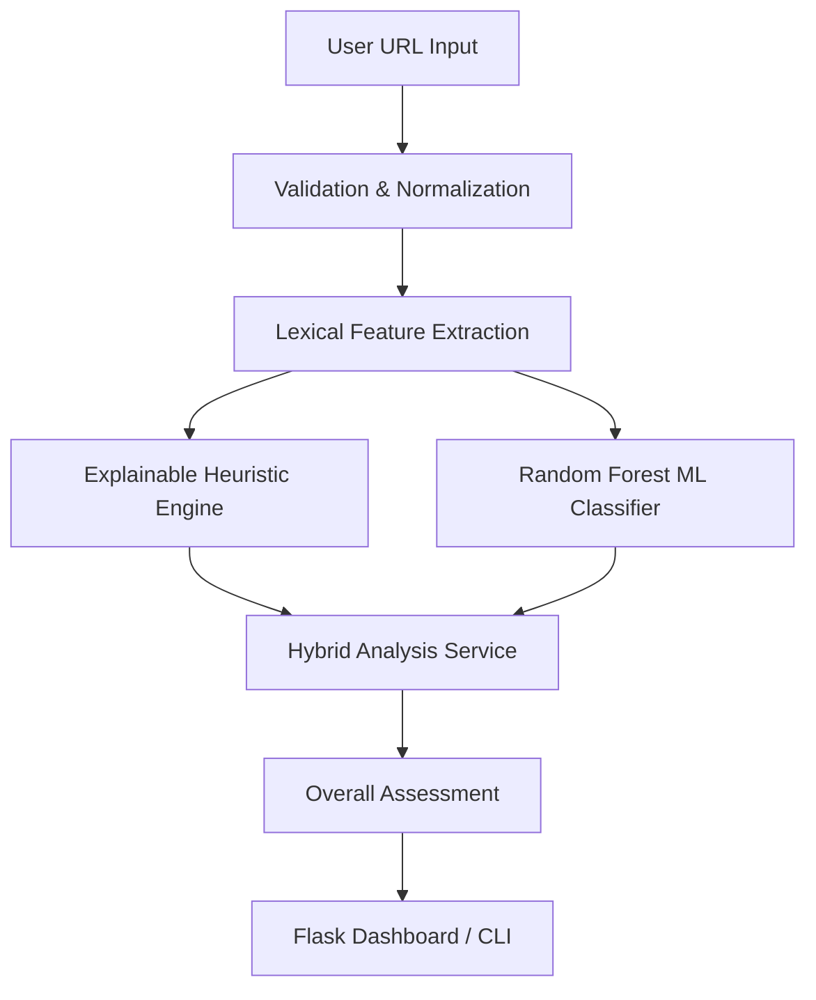

# PhishGuard

**Explainable Hybrid Phishing URL Detection Using Machine Learning and Security Heuristics**


*(Note: No explicit open-source license has currently been selected for this repository.)*

## Overview

PhishGuard is an offline phishing URL analysis system combining transparent security heuristics with machine-learning classification. 

Rather than relying purely on a black-box model, the system pairs a deterministically interpretable heuristic risk engine with a Random Forest classifier. Analysis is 100% offline and static: submitted destination URLs are never intentionally visited, and no external DNS or WHOIS APIs are queried, ensuring complete operational privacy.

## Highlights

- **Hybrid Analysis Engine**: Dual-consensus decision support instead of arbitrary score averaging.
- **Explainable Security Indicators**: Deterministic rule engine assigning transparent risk points.
- **15 Lexical Features**: Extracting URL, hostname, path, character, and term-based structural traits.
- **Random Forest Classifier**: Probabilistic phishing detection trained on full structural URLs.
- **Hostname-Isolated Evaluation**: Rigorous group-aware splitting to prevent domain-level data leakage.
- **Offline / Privacy-Conscious Design**: Zero external network requests during analysis.
- **Flask Dashboard & CLI**: Accessible web interface and rapid terminal analysis tools.
- **Automated Testing**: Comprehensive pytest suite (40 passing tests).

## Demo

| Homepage | Low Concern |
| :---: | :---: |
|  |  |

| Review Recommended (Disagreement) | Elevated Concern |
| :---: | :---: |
|  |  |

## How It Works



Both engines consume the exact same static extracted features. The `AnalysisService` strictly interprets agreement and disagreement between the heuristic points and ML probabilities to produce an Overall Assessment, instead of mathematically diluting them into an average score.

## Detection Features

PhishGuard extracts 15 core lexical features, broadly categorized into:
- **Length Characteristics**: URL length, hostname length, and path length.
- **Punctuation & Digits**: Counts of dots, hyphens, and numeric characters.
- **Network Indicators**: Use of IPv4 hostnames, explicit non-standard ports, and HTTPS.
- **Obfuscation Attempts**: Presence of '@' symbol, punycode ('xn--'), percentage encoding, subdomains, and query parameters.
- **Security-Sensitive Terminology**: Suspicious keywords (e.g., 'login', 'verify').

*(Detailed methodology is available in `docs/METHODOLOGY.md`)*

## Machine Learning

The ML pipeline was trained to compare an interpretable linear baseline against a non-linear ensemble. 

- **Logistic Regression**: Used as the baseline model.
- **Random Forest**: Used as the current inference classifier.
- **GroupShuffleSplit**: Applied based on hostname to enforce strict **hostname isolation**.

Naive row-level dataset splitting suffers from severe data leakage because legitimate/phishing URLs often share the exact same domain name. By isolating hostnames, PhishGuard forces the model to generalize structural patterns rather than memorizing domains. 

*(Note: PhishGuard is not a production-grade appliance, does not detect all phishing patterns, and its probabilistic outputs do not represent absolute certainty.)*

## Results

Models were evaluated exclusively on the independent, hostname-isolated test set (2,277 samples, 0 hostname overlap with training data).

| Metric | Logistic Regression | Random Forest |
|---|---|---|
| Accuracy | 72.51% | 80.28% |
| Precision | 72.05% | 79.36% |
| Recall | 66.16% | 77.47% |
| F1 Score | 68.98% | 78.40% |
| ROC-AUC | 82.10% | 88.52% |
| Average Precision | 83.26% | 87.99% |

**Random Forest** is utilized as the inference engine because it achieved stronger measured performance on this specific held-out dataset. 

## Explainability

PhishGuard explicitly maintains separation between the heuristic risk score and the ML probability. 

**An Important Disagreement Example:**
When analyzing `https://github.com/login`:
- **Heuristic**: 5/100 (LOW)
- **Random Forest**: 85.1% Phishing Probability (SUSPICIOUS)
- **Overall**: REVIEW RECOMMENDED

Legitimate authentication URLs can strongly resemble credential-harvesting phishing URLs structurally (e.g., containing paths like "login"). By preserving engine independence, PhishGuard highlights this known ML limitation and empowers the user with transparent context rather than burying a false positive inside a blended score.

## Security / Privacy Design

PhishGuard respects operational security boundaries:
- **Does not visit** submitted URLs.
- **Does not perform** DNS resolution or WHOIS lookups.
- **Does not download** remote content.
- **Does not execute** submitted content.

Please see [docs/SECURITY.md](docs/SECURITY.md) for full details.

## Installation

```bash
git clone https://github.com/builtbyShay21/PhishGuard.git
cd PhishGuard

# Create and activate a virtual environment
python -m venv venv
# Windows: .\venv\Scripts\Activate.ps1
# Linux/macOS: source venv/bin/activate

pip install -r requirements.txt

python app.py
```

For CLI usage, run:
```bash
python main.py
```

## ML Model Availability

**Trained ML model binaries are intentionally excluded from the Git repository** due to size constraints. 

- **Graceful Fallback**: The Flask application automatically falls back to heuristic-only analysis when the model is unavailable.
- **Reproducing the Model**: The full ML training pipeline (`ml/train.py`) is included. You may train your own model if you have a structurally comparable dataset placed inside `data/raw/`.

## Project Structure

```text
PhishGuard/
├── src/                    # Feature extraction, heuristics, ML inference wrapper
├── ml/                     # ML training, evaluation, and pipeline scripts
├── scripts/                # Dataset preparation and auditing tools
├── templates/              # Flask web UI templates
├── static/                 # CSS/JS assets
├── tests/                  # Automated pytest suite
├── docs/                   # Documentation and methodology
├── app.py                  # Flask application
└── main.py                 # CLI interface
```

## Limitations

- **Static Lexical Analysis Only**: Does not inspect webpage HTML, headers, or certificates.
- **No Active Inspection**: Lack of network/reputation capability limits context.
- **False Positives**: Legitimate login/account URLs may structurally trigger the ML classifier.
- **Obfuscation Techniques**: Evasion tactics (like shorteners) reduce structural effectiveness.
- **Dataset Bias**: Held-out metrics represent specific dataset performance and do not guarantee real-world generalization.

## Documentation

- [Methodology](docs/METHODOLOGY.md)
- [Security Policy](docs/SECURITY.md)

## Dataset Provenance

Raw datasets are not redistributed with this repository. Dataset provenance and redistribution rights are treated separately from the project's source-code licensing. Reported model results should be interpreted only in the context of the audited dataset used during development.
