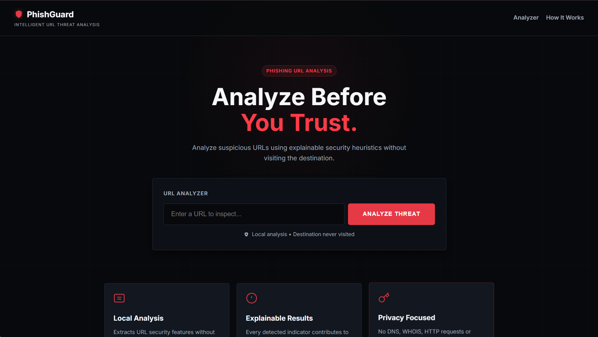
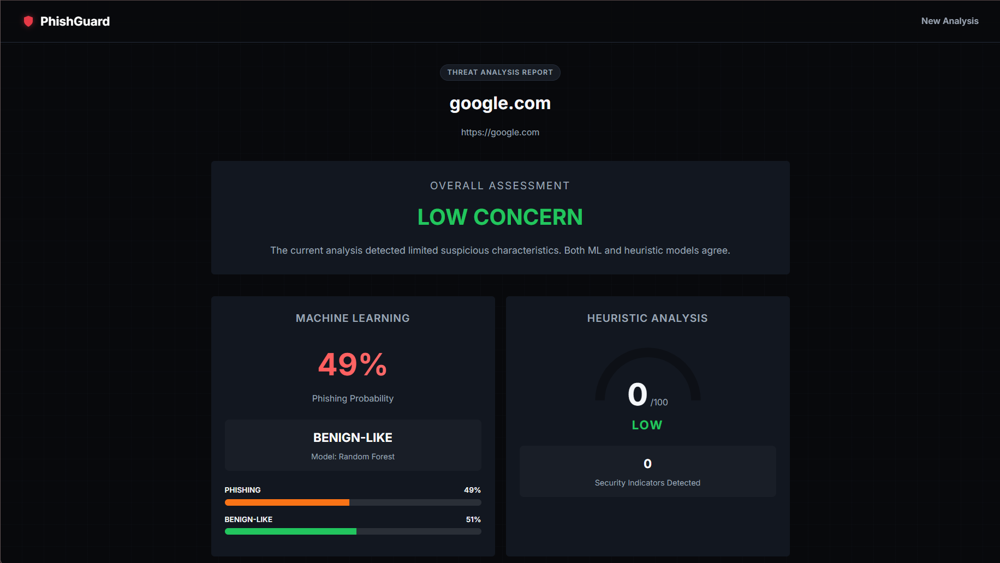
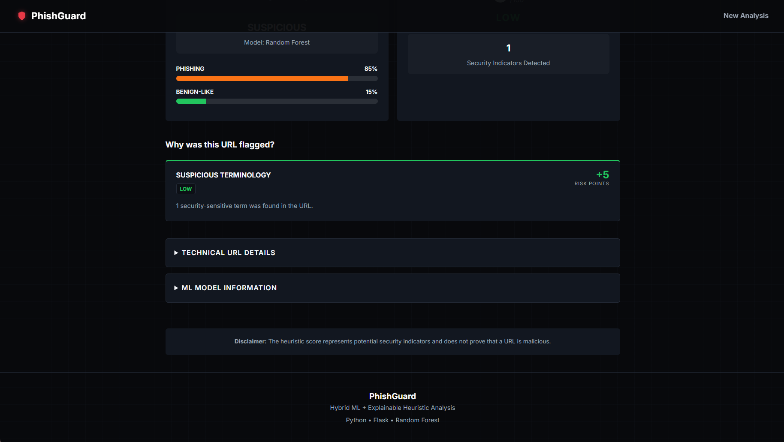
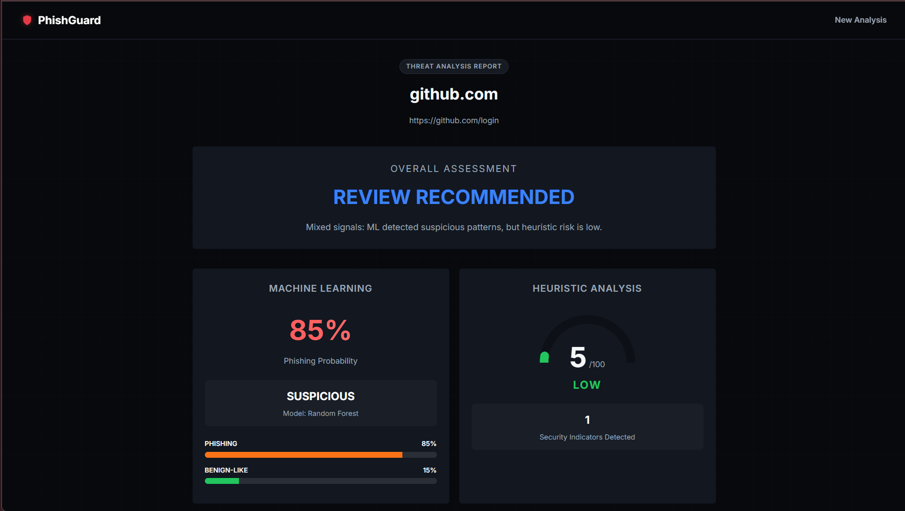
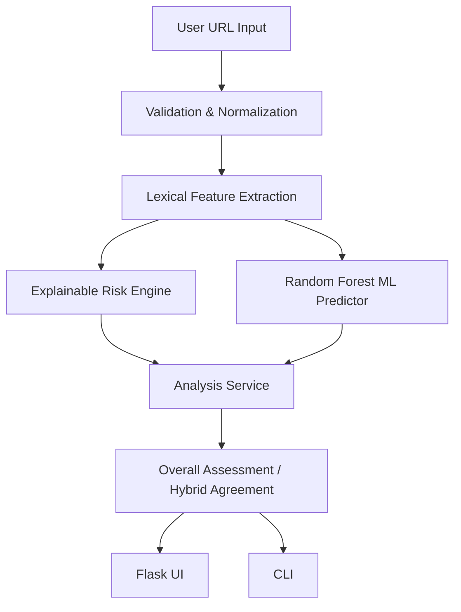

# PhishGuard

**Explainable Hybrid Phishing URL Detection Using Machine Learning and Security Heuristics**


## Overview

PhishGuard is an offline phishing URL analysis system combining transparent security heuristics with machine-learning classification. 

The system analyzes submitted URLs entirely as strings through static lexical analysis. **Destinations are never intentionally visited**, and no external DNS, WHOIS, or reputation APIs are queried, ensuring complete operational privacy and avoiding accidental interaction with malicious infrastructure.

*Note: PhishGuard is a portfolio project and is not intended for production-grade enterprise deployment.*

## Key Features

- **Offline URL Analysis**: 100% local, static analysis of URL strings.
- **Lexical Security Features**: Extraction of 15 security-relevant lexical characteristics.
- **Explainable Heuristic Scoring**: Deterministic rule engine assigning risk points and generating transparent explanations.
- **Random Forest ML Classifier**: Probabilistic phishing detection based on structural patterns.
- **Hybrid Analysis**: Dual-engine consensus interpretation rather than simple score averaging.
- **Group-Aware ML Evaluation**: Hostname-isolated train/test splitting to prevent domain-level data leakage.
- **Modern Flask Dashboard**: Professional web interface for intuitive result interpretation.
- **CLI Tool**: Command-line interface for rapid terminal-based analysis.
- **Automated Testing**: Comprehensive pytest suite (40/40 passing tests).
- **Graceful Fallback**: Continuous heuristic operation even if ML models are unavailable.

## Screenshots

*(Screenshots will be added here)*

| Homepage | Low Risk |
| :---: | :---: |
|  |  |

| Elevated Concern | Review Recommended |
| :---: | :---: |
|  |  |

## Architecture



Both analysis engines consume the exact same static feature dictionary, ensuring strict consistency across the pipeline.

## Security Features

PhishGuard extracts 15 core lexical features for both heuristic and ML analysis:

| Feature | Description |
|---|---|
| `url_length` | Total length of the URL |
| `hostname_length` | Length of the domain name |
| `path_length` | Length of the URL path |
| `num_dots` | Count of '.' characters |
| `num_hyphens` | Count of '-' characters |
| `num_digits` | Count of numeric characters |
| `num_subdomains` | Estimated number of subdomains |
| `is_ipv4` | Whether the hostname is an IPv4 address |
| `has_at_symbol` | Presence of an '@' character |
| `has_punycode` | Presence of 'xn--' indicating punycode |
| `num_percent_encoded` | Count of '%xx' encoded characters |
| `num_query_params` | Number of distinct query parameters |
| `has_non_standard_port` | Whether a non-80/443 port is specified |
| `uses_https` | Whether the scheme is HTTPS |
| `num_suspicious_keywords`| Presence of security-sensitive words (e.g., 'login', 'verify') |

## ML Methodology

**Dataset (TODO: Verify Provenance)**
- Total Usable URLs: 11,428
- Legitimate: 5,715
- Phishing: 5,713

**Group-Aware Hostname Isolation**
A naive row-level train/test split on URL datasets causes severe data leakage because multiple URLs often share the exact same domain name. PhishGuard uses a **group-aware hostname holdout** strategy (`GroupShuffleSplit`) to ensure that all URLs belonging to a specific hostname are placed entirely in either the training set or the test set. 

- **Train Samples**: 9,151 (6,592 unique hostnames)
- **Test Samples**: 2,277 (1,649 unique hostnames)
- **Train/Test Hostname Overlap**: 0

*Note: While hostname isolation dramatically reduces domain-memorization leakage, it does not claim to eliminate all possible dataset or source-level bias.*

## Model Results

Models were evaluated exclusively on the independent, hostname-isolated test set.

| Metric | Logistic Regression | Random Forest |
|---|---|---|
| Accuracy | 72.51% | 80.28% |
| Precision | 72.05% | 79.36% |
| Recall | 66.16% | 77.47% |
| F1 Score | 68.98% | 78.40% |
| ROC-AUC | 82.10% | 88.52% |
| Average Precision | 83.26% | 87.99% |

**Confusion Matrices:**
- **Logistic Regression**: TN 955 | FP 270 | FN 356 | TP 696
- **Random Forest**: TN 1013 | FP 212 | FN 237 | TP 815

*Random Forest is used as the current inference engine because it produced stronger measured results across these specific held-out metrics. This does not indicate it is universally superior against novel threats.*

## Hybrid Analysis Interpretation

PhishGuard deliberately **does not mathematically average** the heuristic risk score and the ML probability. The heuristic score is a deterministic point-based tally, while the ML model outputs a statistical probability; merging them dilutes explainability.

Instead, the `AnalysisService` uses categorical agreement rules (e.g., `LOW CONCERN`, `ELEVATED CONCERN`, `HIGH CONCERN`, `REVIEW RECOMMENDED`).

**Interesting Limitation Example:**
When analyzing `https://github.com/login`:
- **Heuristic**: 5/100 (LOW)
- **Random Forest**: 85.1% Phishing Probability (SUSPICIOUS)
- **Overall**: REVIEW RECOMMENDED

This disagreement perfectly highlights a known limitation: legitimate login URLs often share lexical structures (e.g., paths containing "login") with phishing endpoints. PhishGuard explicitly exposes this conflict rather than suppressing it.

## Limitations

- **Static Lexical Analysis Only**: Does not inspect website HTML/JavaScript content.
- **No External Intelligence**: Does not use DNS, WHOIS, or reputation APIs.
- **Structural Overlap**: Lexical similarity between benign login portals and phishing pages can cause false positives.
- **Evasion Tactics**: Novel phishing patterns (like aggressive URL shorteners) may cause false negatives.
- **Dataset Bias**: Held-out metrics represent performance on this specific dataset partition and do not guarantee equivalent real-world performance.
- **Probabilistic Outputs**: The model output is a statistical prediction, not definitive proof of malicious intent.

## Security Design

PhishGuard operates under strict offline constraints. The application **does not**:
- Visit submitted URLs
- Perform DNS resolution or WHOIS lookups
- Scrape destination pages
- Execute downloaded content

All input is sanitized, URL length is strictly capped to prevent DOS, and Jinja2 templating prevents XSS in the Flask interface.

## Installation

To run PhishGuard locally:

```bash
# Clone the repository
git clone https://github.com/builtbyShay21/PhishGuard.git
cd PhishGuard

# Create and activate a virtual environment
python -m venv venv

# Windows PowerShell:
.\venv\Scripts\Activate.ps1
# Linux/macOS:
# source venv/bin/activate

# Install dependencies
pip install -r requirements.txt

# Run the test suite (optional but recommended)
pytest -v

# Start the Flask web application
python app.py
```
Open `http://127.0.0.1:5000` in your browser.

To use the CLI instead of the web UI:
```bash
python main.py
```

### Model Setup

PhishGuard's source code is fully available, but **trained ML model binaries are intentionally excluded from the Git repository** due to their large file size (60+ MB). 

- **Graceful Fallback**: The Flask and CLI applications can run immediately without the trained model. If `models/random_forest.joblib` is absent, the system gracefully falls back to heuristic-only analysis.
- **Reproducing the Model**: The model can be retrained locally using the included ML pipeline (`ml/train.py`) if you have the required dataset. 
- **Dataset Availability**: The raw datasets are not distributed in this repository pending verification of redistribution rights. You must supply your own valid dataset inside `data/raw/` to retrain the ML pipeline.

## Project Structure

```text
PhishGuard/
├── src/                    # Core pipeline (validation, features, heuristic, ML)
├── ml/                     # Machine learning training and evaluation scripts
├── models/                 # Serialized joblib models (if distributed)
├── templates/              # Flask HTML templates
├── static/                 # CSS/JS assets
├── tests/                  # Pytest automated test suite
├── docs/                   # Extended methodology and security documentation
├── app.py                  # Flask web server
├── main.py                 # CLI interface
└── requirements.txt        # Python dependencies
```

## License and Dataset Provenance

**License Selection**: Please refer to the repository owner's `LICENSE` file for source code usage rights. 
**Dataset Provenance**: Source datasets are omitted from this repository pending proper attribution and redistribution rights verification (TODO). Third-party datasets do not inherit the project's software license.
